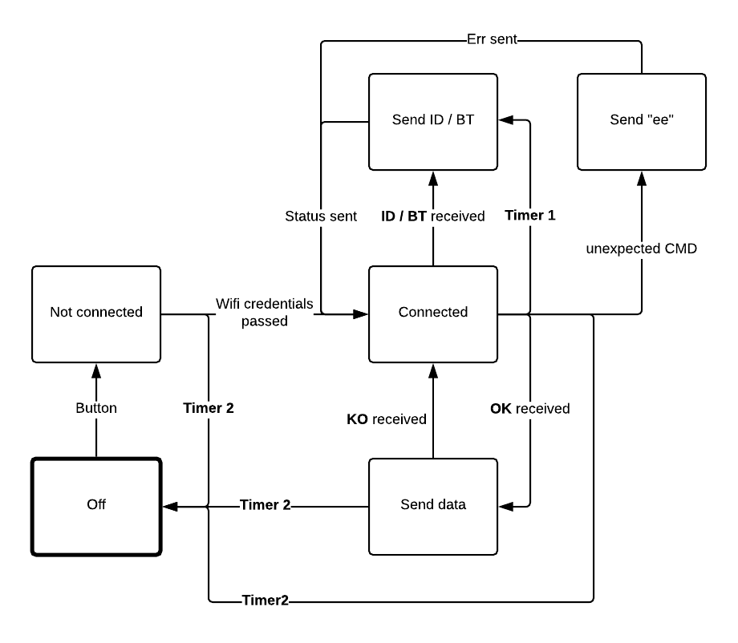

# DEVICE EMULATOR

ESP motion device emulator

## Run

1. `clone`
2. `yarn install`
3. `yarn start`

# Device State diagram

- `Timer1` - each N seconds sends "ID" packet with ESP Unique ID
- `Timer2` - it handle automatic shutdown, any received data / cmd will reset timer

(Emulator will never reach "Not connected" and "Off" state)

# Protocol:

Device comunicates over UDP socket, it respond always to IP which sent CMD.

comunication port is `54321`

# Comands 

response to command should be always comand name + data

| Cmd                  | Expected echo      |
|----------------------|--------------------|
| "bt" [`0x6F`,`0x6B`] | "bt" + `2B int_16` |
| "id" [`0x6B`,`0x6F`] | "id" + `6B` id     |
| "ko" [`0x62`,`0x74`] | stop data          |
| "ok" [`0x69`,`0x64`] | start data         |

- any other unexpected command will end with `ee` 2B

> Data Packet
>> sent each 50ms with 50samples, so its 1000 samples per sec. + additional Magnetometer data sampled to 20 per sec.

|DEVICE_ID|ACC|TMP|GYR|MAG| + 49x ACC + TMP + GYR|SUM|
|-|-|-|-|-|-|-|
|6B|6B|2B|6B|6B|**14B** (6B + 2B + 6B)|`712B`|

> ACC / GYR / MAG

|X|Y|Z|SUM|
|-|-|-|-|
|2B|2B|2B|`6B`|

> TMP / BT 

|INT_16|
|-|
|`2B`|

# Units 

- `ACC` full scale = `16G`
- `GYR` full scale = `2000dps`
- `MAG` full scale = `4800µT`

# P.S. Take care of Endian
- bad command returns `"ee"`
